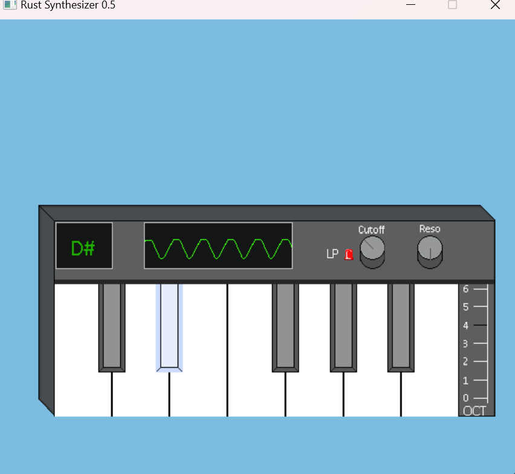

# Rust Synthesizer with GUI

Software synthesizer programmed in Rust using crates [rodio](https://crates.io/crates/rodio) for audio playback, 
[minifb](https://crates.io/crates/minifb) for handling of user input 
and [image](https://crates.io/crates/image) for sprite rendering. 
All assets are made by me using [Aseprite](https://www.aseprite.org/).

## Requirements
* [Rust](https://www.rust-lang.org/tools/install)

## Cargo dependencies

* [rodio](https://crates.io/crates/rodio)
* [minifb](https://crates.io/crates/minifb)
* [image](https://crates.io/crates/image)

## Running program: Cargo

The shell script 'up' builds and runs our application by executing the following:
```
1. cargo build
2. cargo run
```

## Running program: x86 executable for Windows

One may also run an executable directly. This has been compiled for target 'x86_64-pc-windows-msvc'
utilizing 'cargo build --release'
```
./synthesizer.exe
```

## Screenshot


## Synthesizer Key Controls
Musical Notes:

    Q: Play musical note C in octave 4 (261.63 Hz)
    2: Play musical note C# in octave 4 (277.18 Hz)
    W: Play musical note D in octave 4 (293.66 Hz)
    3: Play musical note D# in octave 4 (311.13 Hz)
    E: Play musical note E in octave 4 (329.63 Hz)
    R: Play musical note F in octave 4 (349.23 Hz)
    5: Play musical note F# in octave 4 (369.99 Hz)
    T: Play musical note G in octave 4 (392.00 Hz)
    6: Play musical note G# in octave 4 (415.30 Hz)
    Y: Play musical note A in octave 4 (440.00 Hz)
    7: Play musical note A# in octave 4 (466.16 Hz)
    U: Play musical note B in octave 4 (493.88 Hz)

Octave Control:

    F1: Decrease the octave (1 is minimum)
    F2: Increase the octave (5 is maximum)

Waveform Control:

    F: Toggle waveform between sine and square